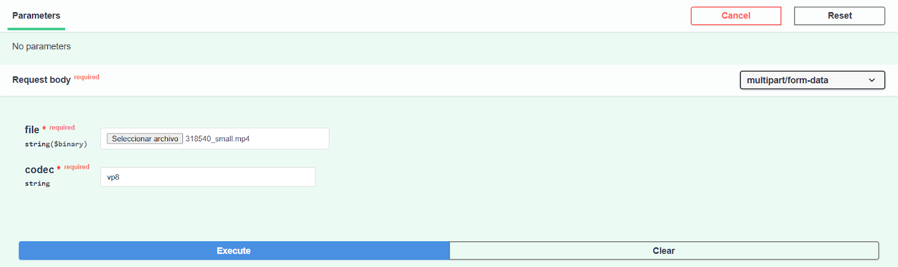
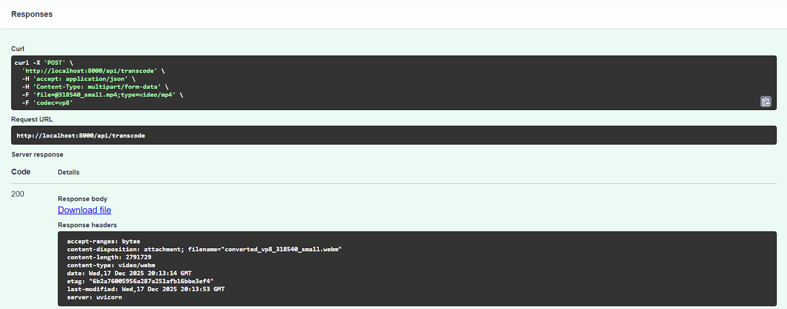
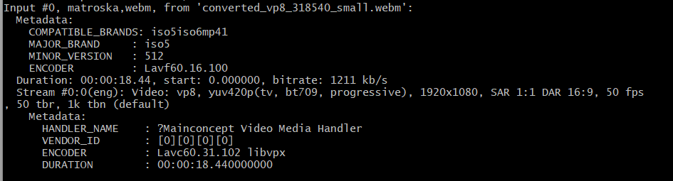
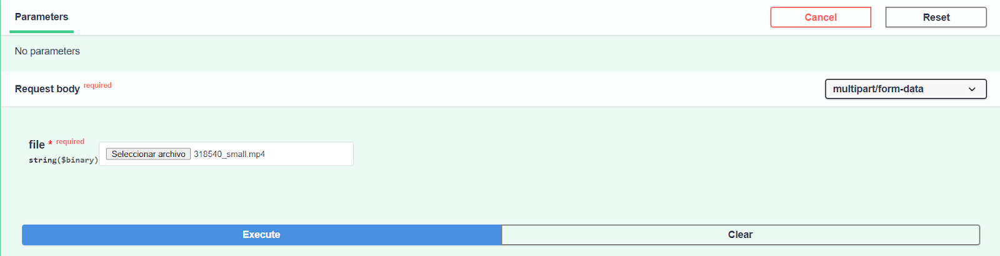
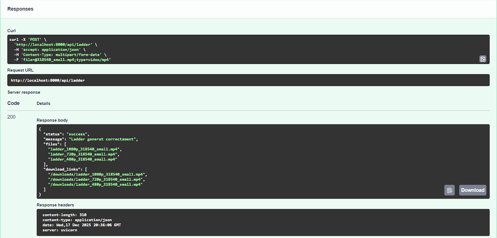
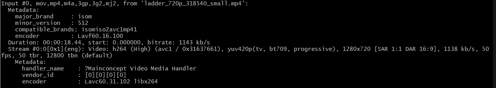
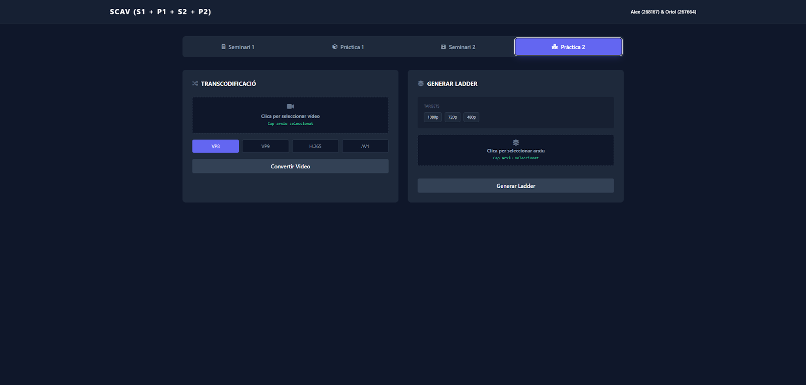
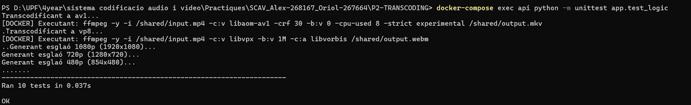

# Pràctica 2: Transcoding

En aquesta pràctica ens hem centrat en la transcodificació de vídeos. Hem aplicat funcions per canviar de còdecs (AV1, VP8, VP9, H265) i l'encodificació d’escala per generar diferents resolucions simultàniament del mateix vídeo. A més, hem creat una GUI personalitzada per a la nostra API.

## Estructura del Projecte

Hem utilitzat la mateixa estructura que la del Seminari 2, afegint una carpeta `app/templates/index.html` per incloure la GUI de la nostra API. També hem modificat els scripts `app/scav_logic.py`, `app/main.py` i `app/test_logic.py` per incloure les funcionalitats necessàries per a la pràctica.

```text
Practice2/
├── app/
│   ├── __init__.py
│   ├── main.py          # [API amb nous endpoints enfocats al processament de vídeo]
│   ├── scav_logic.py    # [Nova classe VideoProcessor amb la lògica de les diferents tasques]
│   ├── test_logic.py
│   └── templates/
│       └── index.html   # [Interfície Gràfica]
├── ffmpeg/
│   └── Dockerfile
├── Dockerfile
├── docker-compose.yml   # [API + FFmpeg]
├── requirements.txt
└── shared_data/

```

## Nous Endpoints (API)

Els nous endpoints que s’han creat han sigut els següents:

---

## Task 1: Transcodificar el còdec d’un vídeo

> **Enunciat:** *"Create a new endpoint/feature to convert any input video into VP8, VP9, h265 & AV1."*

Aquest endpoint ens permet penjar un vídeo a la nostra API i transcodificar-lo a un altre còdec com, per exemple, VP8, VP9, H.265 i AV1.

* **Endpoint:** `POST /api/transcode`

**Funcionament:**

1. Pengem un vídeo i especifiquem el **còdec** de destí (per exemple: `vp8`, `vp9`, `h265` o `av1`). Aquest paràmetre és necessari per indicar al sistema a quin format volem convertir l'arxiu.
2. Fem servir la llibreria `docker` de Python per enviar la comanda `ffmpeg -c:v ...` (definint el codificador de vídeo corresponent) al contenidor de FFmpeg.
3. Per evitar saturar el navegador amb la descàrrega de fitxers grans durant processos lents com la transcodificació, l'endpoint retorna un JSON amb la ruta del fitxer output a la carpeta per defecte `shared_data` a la que podem accedir en local per comprovar els resultats.

**Exemple d'ús:**
Input:

Output:

Verificació amb ffprobe:


---

## Task 2: Generar diferents resolucions per al mateix vídeo

> **Enunciat:** *"Create a new endpoint/feature to be able to do an encoding ladder"*

Aquest endpoint genera automàticament tres versions del vídeo original a diferents resolucions, simulant els esglaons necessaris per a un sistema de streaming adaptatiu (ABR).

* **Endpoint:** `POST /api/ladder`

**Resolucions generades:**

* **1080p** (1920x1080) » Alta qualitat.
* **720p** (1280x720) » Qualitat mitjana.
* **480p** (854x480) » Baixa qualitat.

**Implementació:**
Per no repetir codi, hem creat un bucle que recorre la llista de resolucions que volem. A cada volta, aprofitem l'herència i cridem al mètode `resize_video` de la classe pare, que és qui realment executa la comanda `ffmpeg -vf scale=...`. Al final, el sistema ens retorna un JSON amb els enllaços preparats per descarregar les tres versions del vídeo.

**Exemple d’ús:**
Input:

Output:

Verificació amb ffprobe a una de les resolucions generades:



---

## Task 3: Creació d’una GUI

> **Enunciat:** *"Create a GUI to be the final work of your monster API!"*

**Implementació:**
La GUI és creada en l’arxiu `index` dins de la carpeta `app/templates/index.html`. La GUI s'ha dissenyat com una **Single Page Application (SPA)**, on tota la interacció succeeix en una única pàgina (`index.html`) sense necessitat de recàrregues, oferint una experiència d'usuari fluida i ràpida.

### 1. Tecnologies i Frameworks Utilitzats

Per crear la interfície s'han utilitzat tecnologies estàndard web carregades via CDN (*Content Delivery Network*) per mantenir el projecte lleuger i sense processos de compilació complexos:

* **HTML5:** Estructura semàntica de la pàgina.
* **Tailwind CSS:** Framework d'estils "utility-first". S'ha utilitzat per dissenyar tota la interfície (colors, espaiats, tipografia, mode fosc) directament des de les classes HTML (ex: `bg-slate-900`, `text-emerald-400`).
* **FontAwesome:** Llibreria d'icones vectorials per als botons i indicadors visuals (ex: `<i class="fas fa-video"></i>`).
* **JavaScript (Vanilla ES6):** Lògica de client nativa sense frameworks externs (com React o Vue) per gestionar la interactivitat del DOM i les peticions al servidor.

### 2. Estructura de l'Arxiu `index.html`

La interfície es divideix lògicament en tres components principals:

* **Navegació per Pestanyes:** S'ha implementat un sistema de pestanyes (*Tabs*) que permet canviar entre les diferents pràctiques (S1, P1, S2, P2).
* *Funcionament:* Tots els continguts es carreguen inicialment però s'amaguen amb CSS (`hidden`). La funció JavaScript `switchTab()` gestiona la visibilitat, mostrant només el `div` actiu i actualitzant l'estat dels botons.


* **Terminal de Sortida:** Una àrea de text amb fons fosc que simula una consola per mostrar els logs i resultats JSON retornats per l'API.

### 3. Integració i Canvis al `main.py`

L'arxiu `main.py` actua com a servidor web que "serveix" aquesta GUI al navegador. S'han realitzat els següents canvis claus per permetre aquesta integració:

* **Motor de Plantilles (Jinja2):** S'ha configurat `Jinja2Templates` per renderitzar l'arxiu `index.html` quan l'usuari accedeix a l'arrel (`/`). Això permet servir l'HTML dinàmicament.
```
templates = Jinja2Templates(directory="app/templates")

@app.get("/", response_class=HTMLResponse)
def root(request: Request):
    return templates.TemplateResponse("index.html", {"request": request})

```
* **Servidor d'Arxius Estàtics (StaticFiles):** S'ha muntat una ruta especial `/downloads` que apunta directament a la carpeta compartida del sistema (`/shared`). Això és vital per a la GUI, ja que permet generar enllaços de descàrrega directes (ex: per al Ladder o els vídeos transcodificats) que l'HTML pot oferir a l'usuari.
```
app.mount("/downloads", StaticFiles(directory=SHARED_FOLDER), name="downloads")

```

Imatge de la pestanya de la Practica 2:


## Task 4: Millores de la IA i implementacio de unittest

**Enunciat:** *"Now it’s time to use AI! Try to improve and reduce lines of your code. Add unit tests, or ask me for good practices to improve everything."*

## Informe de Millores i Optimització amb IA

S'ha utilitzat IA per analitzar i refactoritzar el codi, implementant les següents millores tècniques:

* **Refactorització (Principi DRY):** S'ha unificat la lògica de gestió d'arxius a `main.py` mitjançant la funció auxiliar `save_file_to_shared`, eliminant redundància en els *endpoints*.
* **Patró Singleton:** S'ha optimitzat `scav_logic.py` implementant una connexió estàtica amb el client Docker, evitant re-connexions innecessàries i estalviant recursos.
* **Optimització AV1:** S'ha accelerat la transcodificació del còdec AV1 afegint el paràmetre `-cpu-used 8`, permetent proves d'integració viables sense bloquejos temporals.
* **Tests amb Mocking:** S'ha actualitzat `test_logic.py` utilitzant `unittest.mock` per simular el contenidor Docker. Això permet validar la generació correcta de comandes FFmpeg instantàniament sense dependre de l'execució real.

---

### Execució dels Tests Unitaris

Per poder comprovar els unittest s'ha executar el següent comandament:
```
docker-compose exec api python -m unittest app.test_logic
```
Comprovacio dels unittest:


## **Instruccions d'Ús i Desplegament**

El procediment per aixecar el docker es el mateix que en les anteriors practiques, tot i que amb un petit canvi al inserir la GUI. 

1. **Netejar el docker compose existent**

```
docker-compose down
```

2. **Construir de nou el docker compose i aixecar el servei**

```
docker-compose up --build
```

3. **Accedir a la API** a través del navegador: [http://localhost:8000/docs](https://www.google.com/search?q=http://localhost:8000/docs). La nova secció **"P2 \- Transcoding"** conté tots els endpoints descrits. Per accedir a la GUI s'haura d'introduir la següent direcció [http://localhost:8000]

4. **Gestió de Fitxers:** Tots els vídeos processats es guardaran automàticament a la carpeta `shared_data` de la carpeta arrel amb el nom de sortida definit en cada cas. 

## **Autors**

* **\[Oriol Tutusaus \- 267664\]**  
* **\[Alex Alastuey \- 268167\]**

*SCAV – Practica 2*
