# **Seminari 2: MPEG4 & More Endpoints**

Aquest repositori es basa en la resolució del *Seminari 2*, sent aquest l’extensió del *Seminari 1* i la *Pràctica 1*. En aquest cas hem afegit a la nostra API capacitats de manipulació i imatge de vídeo fent servir *FFmpeg* dins un contenidor independent. 

## **Estructura del Projecte**

Hem mantingut l’estructura bàsica del projecte, implementant la lògica de les noves funcions a *app/scav\_logic.py* amb tots els endpoints corresponents a *app/main.py*. Aquests endpoints i lògica es corresponen a les diferents tasques proposades pel *Seminari 2*. 

```
→ Practice1/
	→ app/
		→ __init__.py
		→ main.py [API amb nous endpoints enfocats al processament de vídeo]
		→ scav_logic.py [Nova classe VideoProcessor amb la lògica de les diferents tasques]
	→ ffmpeg
		→ Dockerfile
→ Dockerfile
	→ docker-compose.yml   [API + FFmpeg]
	→ requirements.txt
	→ shared_data/
```

## **Nous Endpoints (API)**

Els diferents *endpoints* que hem afegit i implementat son els següents:
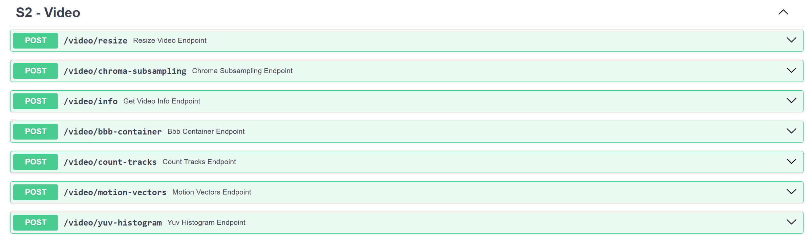

## **Task 1: Redimensionament de Vídeo**

**Enunciat:** *"Create a new endpoint / feature which will let you to modify the resolution (use FFmpeg in the backend)."*

Hem implementat un endpoint que permet penjar un vídeo que tinguem descarregat en local i canviar-li la resolució.

- **Endpoint:** `POST /video/resize`  
- **Funcionament:**  
  1. Pengem un vídeo i especifiquem `width` i `height`. En cas de només especificar una de les dues dades es mantindrà la relació d’aspecte original i, en cas de que no indiquem res, per defecte obtindrem un vídeo amb la meitat de resolució que l’original  
  2. Fem servir la llibreria `docker` de Python per enviar la comanda `ffmpeg -vf scale=...` al contenidor de *FFmpeg*.  
  3. Per evitar saturar el navegador amb la descàrrega de fitxers grans, l'endpoint retorna un JSON amb la ruta del fitxer output a la carpeta per defecte `shared_data` a la que podem accedir en local per comprovar els resultats.

**Exemple d'ús:**

Input:
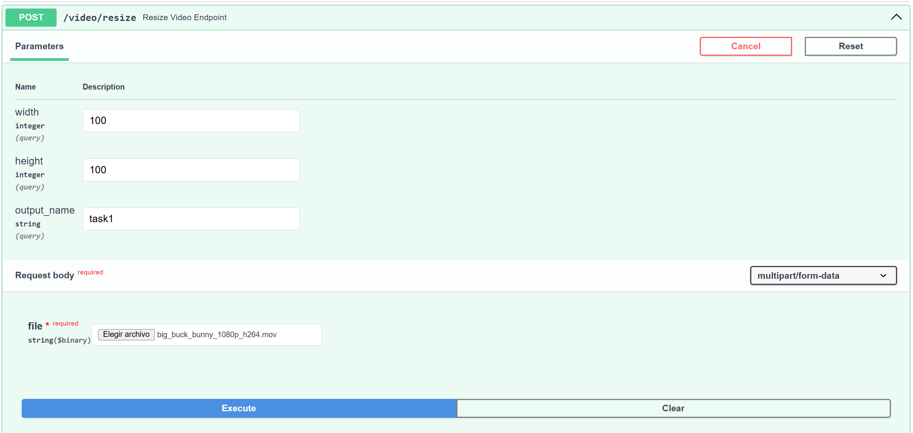
Output:
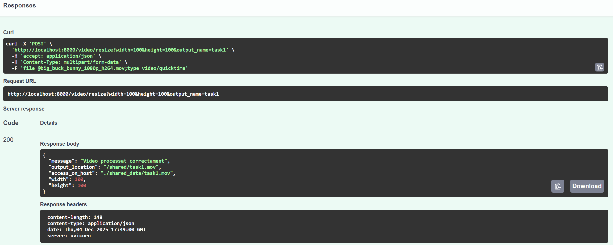
Verificació amb *ffprobe* (canvi de resolució):
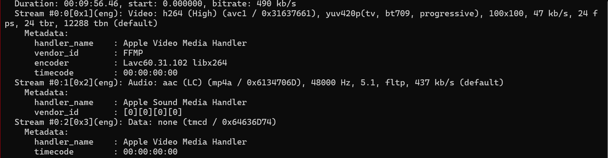

## **Task 2: Submostreig de Croma (Chroma Subsampling)**

**Enunciat:** *"Create a new endpoint / feature which will let you to modify the chroma subsampling."*

Aquest endpoint permet canviar el *chroma subsampling* del vídeo, cosa que afecta a com es guarda la informació de color.

- **Endpoint:** `POST /video/chroma-subsampling`  
- **Opcions disponibles:**  
  - `yuv420p` (Estàndard, 4:2:0)  
  - `yuv422p` (Alta qualitat, 4:2:2)  
  - `yuv444p` (Sense compressió de color, 4:4:4)  
- **Implementació:** Utilitza el flag `-pix_fmt` de *FFmpeg* i recodifica el vídeo amb `libx264` per aplicar els canvis.

**Exemple d'ús:**

Input (canviant a `yuv444p`, sent `yuv420p` l’original):
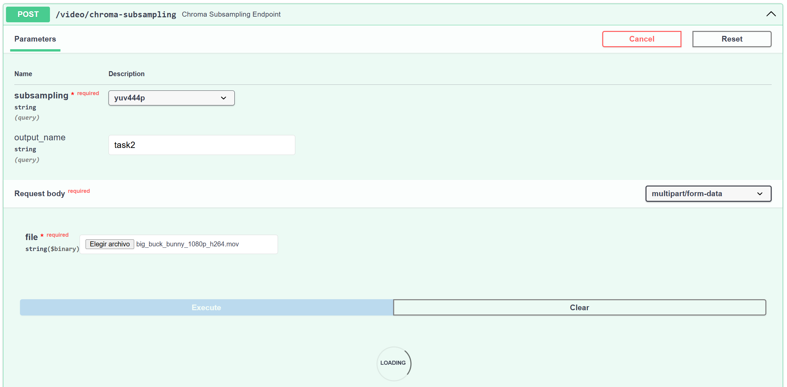
Output:
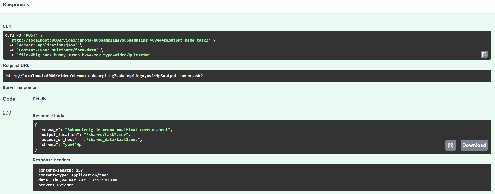
Verificació amb ffprobe (format de pixel):
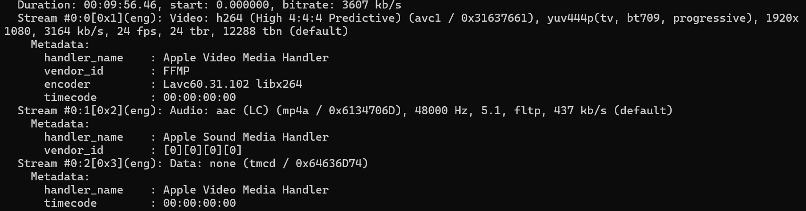
## **Task 3: Informació del Vídeo**

**Enunciat:** *"Create a new endpoint / feature which lets you read the video info and print at least 5 relevant data from the video."*

Aquesta funcionalitat extreu les metadades del fitxer de vídeo que escollim com a entrada del procés.

- **Endpoint:** `POST /video/info`  
- **Eina:** Utilitza `ffprobe` i JSON per la sortida.  
- **Dades que es mostren a la sortida:**  
  - Nom del contenidor.  
  - Format del contenidor.  
  - Durada en segons.  
  - Còdec de vídeo i àudio.  
  - Resolució i Frame Rate.  
  - Bitrate.

**Exemple d'ús i resultat JSON:**
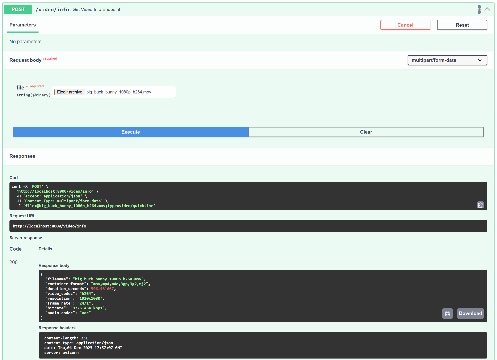

## **Task 4: Creació d'un Contenidor BBB**

**Enunciat:** *"You’re going to create another endpoint in order to create a new BBB container. It will fulfill this requirements:*

- *Cut BBB into 20 seconds only video.*  
- *Export BBB(20s) audio as AAC mono track.*  
- *Export BBB(20s) audio in MP3 stereo w/ lower bitrate*  
- *Export BBB(20s) audio in AC3 codec*

 *Now package everything in a .mp4 with FFMPEG\!\!"*

Aquesta tasca implica els següents passos:

- Tallar el vídeo als 20 segons de l’inici.  
- Generar 3 pistes d'àudio amb les següents característiques:  
1. AAC, mono.  
2. MP3, stereo (menys bitrate)  
3. AC3. 

- **Endpoint:** `POST /video/bbb-container`  
- **Procés:**  
  1. Retalla el vídeo als primers 20 segons (`-t 20`).  
  2. Copia el vídeo (`-c:v copy`).  
  3. Genera 3 pistes d'àudio a partir de l’àudio original fent servir `-map`.

**Exemple d'ús:**

Input:
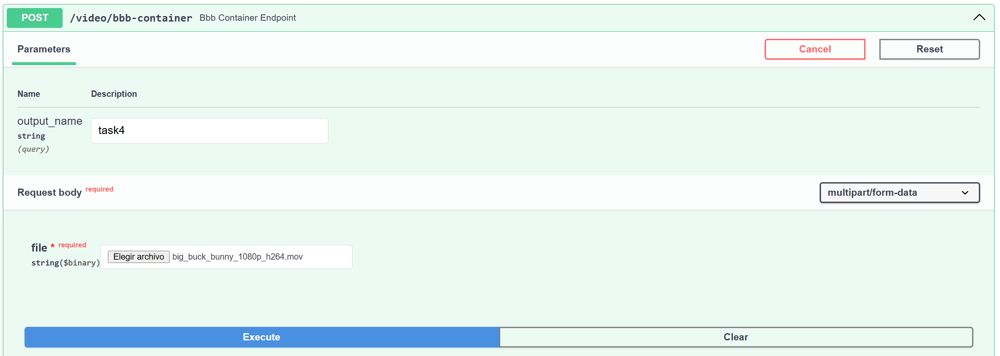
Output:
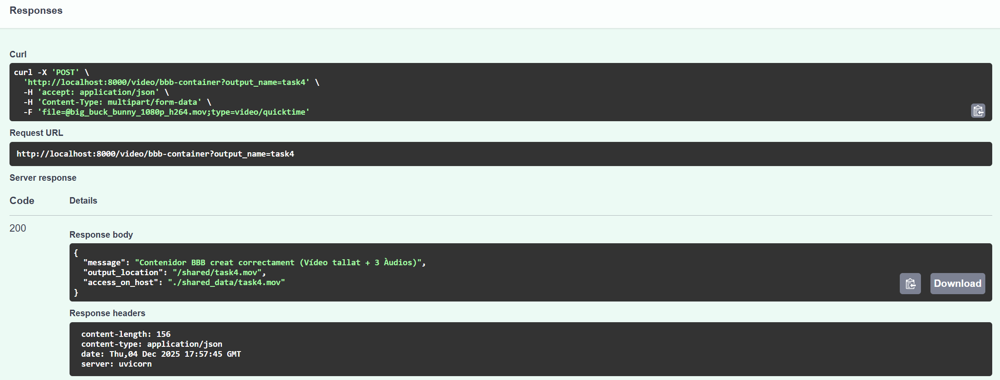
Verificació amb ffprobe (4 streams totals):
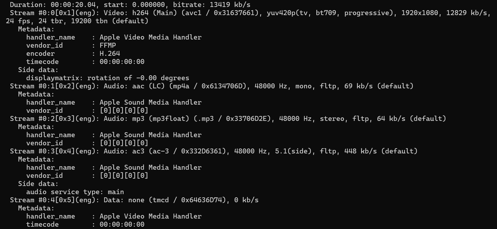

## **Task 5: Comptador de Pistes (Tracks)**

**Enunciat:** *"Create a new endpoint / feature which reads the tracks from an MP4 container, and it's able to say how many tracks does the container contains."*

Un cop acabada la implementació d'aquest endpoint podrem comprovar de manera més còmoda si la Task 4 ha retornat un resultat correcte. 

* **Endpoint:** `POST /video/count-tracks`  
* **Funcionament:** Analitza el fitxer amb `ffprobe` i conta quants streams conté. Retorna el número total i el tipus i còdec de cadascun dels streams.

**Exemple d'ús (analitzant el fitxer de la Task 4):**
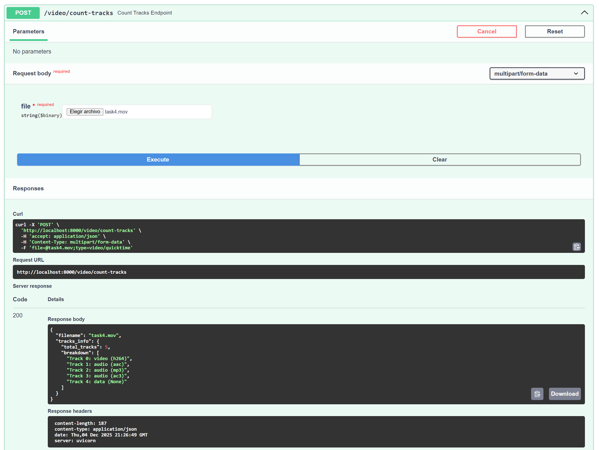

## **Task 6: Visualització de Macroblocs i Vectors de Moviment**

**Enunciat:** *"Create a new endpoint / feature which will output a video that will show the macroblocks and the motion vectors."*

Amb aquesta funcionalitat podem veure com funciona la compressió de vídeo, entenent els vectors de moviment i com es comporten. En el nostre cas hem superposat aquests vectors de moviment sobre el vídeo original per poder tenir la imatge com a referència i entendre quines dades es poden extreure. 

- **Endpoint:** `POST /video/motion-vectors`  
- Hem fet servir el flag `-flags2 +export_mvs` combinat amb el filtre `codecview=mv=pf+bf+bb` per sobreposar les fletxes de moviment a la imatge.

**Exemple d'ús:**

Input:
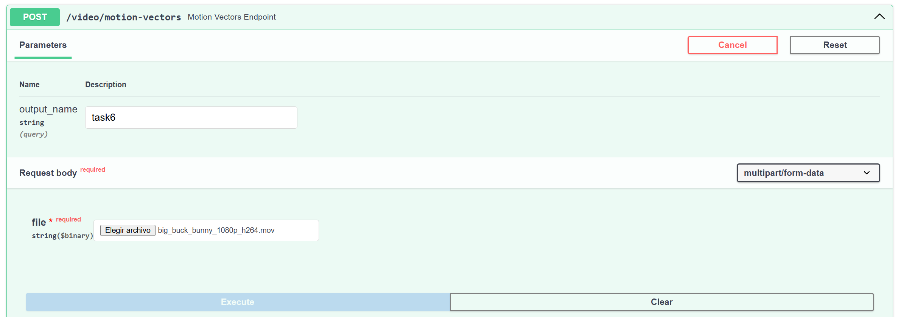
Output:

**Resultat visual (Fotograma extret del vídeo output on es veuen els vectors de moviment):**
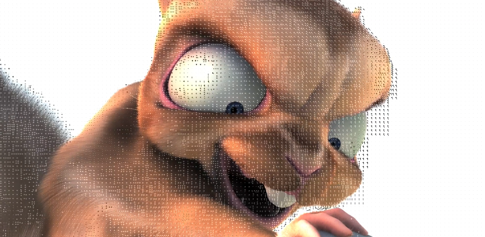

## **Task 7: Histograma YUV**

**Enunciat:** *"Create a new endpoint / feature which will output a video that will show the YUV histogram."*

En aquest cas hem implementat un generador d’histograma YUV en temps real que es superposa a la imatge. 

- **Endpoint:** `POST /video/yuv-histogram`  
- Fem servir un filtre (`filter_complex`) que:  
  1. Divideix el vídeo en dos.  
  2. Genera l'histograma d'una còpia.  
  3. Superposa l'histograma damunt del vídeo original perquè es puguin veure simultàniament.

**Exemple d'ús:**

Input:
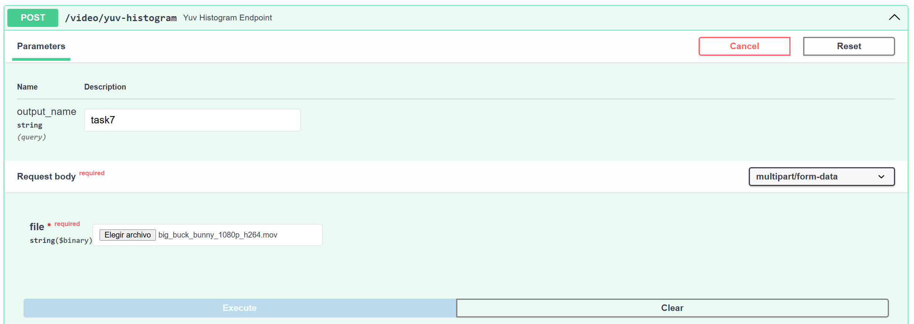
Output:
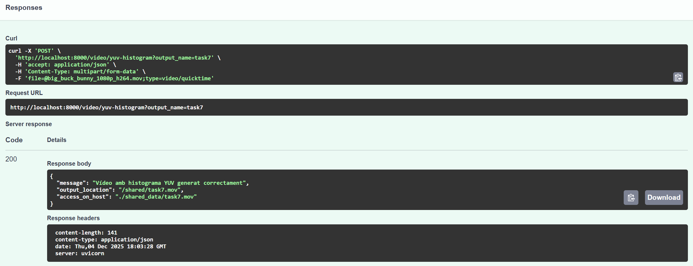
**Resultat visual (Fotograma extret del vídeo output on es veu l’histograma superposat):**
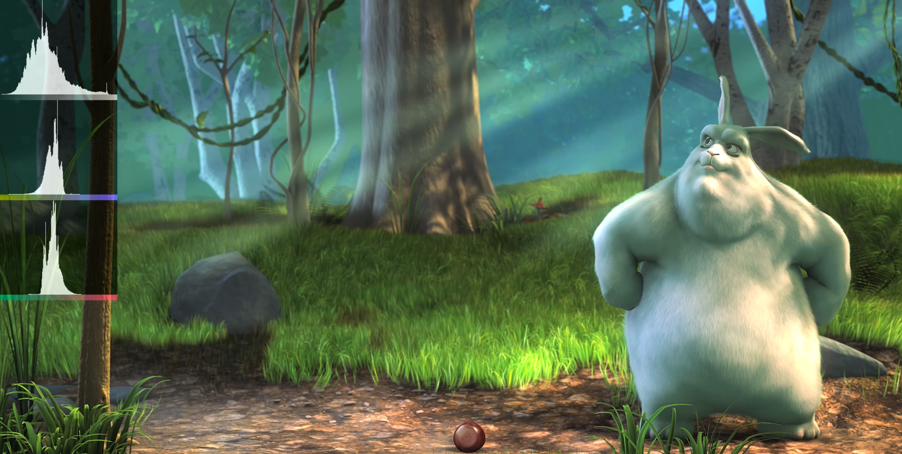

## **Instruccions d'Ús i Desplegament**

Tot i que el procediment per executar el projecte amb les noves funcionalitats descrites és el mateix que el de la *Pràctica 1* hem de reconstruir la imatge per incloure aquestes noves funcionalitats. 

1. **Netejar el docker compose existent**

```
docker-compose down
```

2. **Construir de nou el docker compose i aixecar el servei**

```
docker-compose up --build
```

3. **Accedir a la API** a través del navegador: [http://localhost:8000/docs](https://www.google.com/search?q=http://localhost:8000/docs). La nova secció **"S2 \- Video"** conté tots els endpoints descrits.   
4. **Gestió de Fitxers:** Tots els vídeos processats es guardaran automàticament a la carpeta `shared_data` de la carpeta arrel amb el nom de sortida definit en cada cas. 

## **Autors**

* **\[Oriol Tutusaus \- 267664\]**  
* **\[Alex Alastuey \- 268167\]**

*SCAV – Seminari 2*
